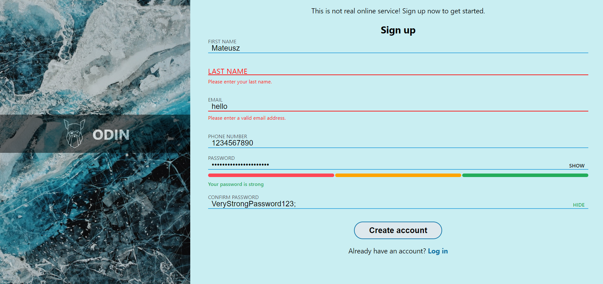

# Sign-Up Form
This is a simple implementation of a sign-up form using HTML, CSS, and JavaScript. The project allows users to create a new account by providing their name, email address, phone number, password, and confirming the password.

## Demo

[Live](https://sign-up-form-lewocz.netlify.app/)
Desktop:

Phone:
.png)